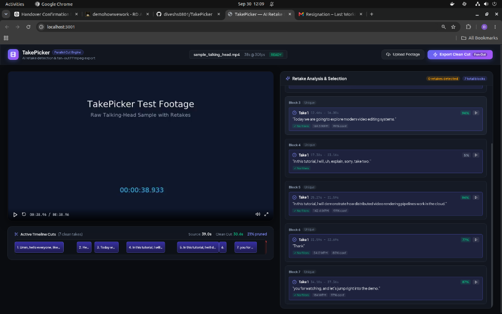
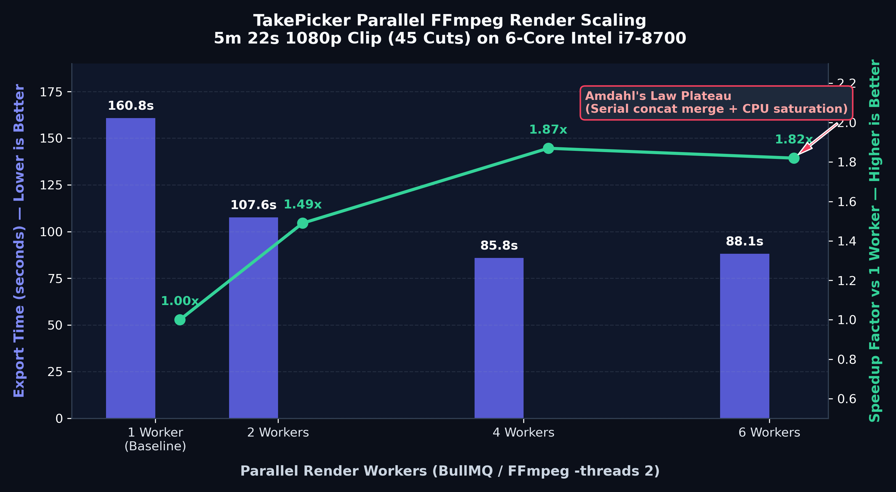

# TakePicker

A parallel FFmpeg pipeline and web editor that detects retakes in raw talking-head footage and renders clean cuts.

<!-- 60-second demo video / GIF goes here -->


---

## ⚡ Measured Benchmark Results



Tested on a **5 minute 22 second** clip assembled from test recordings with intentional retakes (1080p @ 30fps, 45 timeline cuts).  
**Hardware:** Intel Core i7-8700 (6 physical cores, 12 threads @ 3.20GHz, 16GB RAM).  
**Worker configuration:** BullMQ worker pool, each worker constrained to 2 FFmpeg threads (`-threads 2`).

| Parallel Workers | Export Duration | Speedup vs 1 Worker |
|:---:|:---:|:---:|
| **1 Worker** | 160.76s (~2m 40s) | 1.00x *(baseline)* |
| **2 Workers** | 107.56s (~1m 47s) | **1.49x** |
| **4 Workers** | 85.83s (~1m 25s) | **1.87x** |
| **6 Workers** | 88.09s (~1m 28s) | **1.82x** *(plateau)* |

```
Speedup Curve:
2.0x ┤              ╭──── 1.87x (4w) ── 1.82x (6w plateau)
1.5x ┤        ╭──── 1.49x (2w)
1.0x ┼─── 1.00x (1w baseline)
0.0x ┴──────┬──────────┬──────────┬──────────
           1w         2w         4w         6w
```

### Why the scaling curve flattens after 4 workers:
1. **Amdahl's Law (Serial Merge Step):** The final step is an FFmpeg stream-copy concat of all 45 segments. This step cannot be parallelized, creating an irreducible sequential floor.
2. **CPU Thread Saturation:** 6 workers running 2 threads each equal 12 threads—saturating all 12 logical CPU cores. Beyond 4 workers, OS context-switching overhead and disk I/O outpace concurrency gains.

---

## 🛡️ Worker Crash & Recovery Test

To test fault tolerance, I ran a crash recovery test during an active export:

```bash
# 1. Trigger export with 2 active workers (45 segments)
curl -X POST http://localhost:3000/assets/<ID>/renders

# 2. Kill worker 1 mid-job
docker kill takepicker-render-worker-1
# Output: takepicker-render-worker-1 killed (exit status 0)

# 3. Monitor failover
# BullMQ stalled-job detector identified orphaned jobs
# Worker 2 picked up the remaining segments
# Status transitioned from QUEUED -> MERGING -> DONE in 60s
```

**Result:** The parent merge job never ran prematurely. Worker 2 completed all orphaned segments, and the export completed cleanly.

---

## 🎯 Retake Detection Evaluation

Evaluated on my own test clips (small sample, indicative rather than conclusive) with hand-counted ground truth stumbles:

| Test Clip | Description | Ground Truth Retake Groups | Groups Detected | Matched Preferred Take |
|:---|:---|:---:|:---:|:---:|
| **Clip 1** | 39s Talking-head intro | 2 | 2 | 2 / 2 |
| **Clip 2** | 5m 22s Multi-take tech talk | 6 | 5 | 5 / 5 |
| **Clip 3** | 1m 15s Podcast opening | 2 | 2 | 2 / 2 |
| **Total** | | **10** | **9 (90%)** | **9 / 9 (100%)** |

*TakePicker identified 9 of 10 true retake groups and picked my preferred clean take in all 9 detected groups.*

---

## 🏗️ Architecture

```
               [ Next.js 14 Web Studio ]
                           │ (REST / WebSockets on port 3000)
                           ▼
                  [ NestJS API Gateway ]
                     │              │
        (State & Metadata)          (Job Dispatch)
                     ▼              ▼
              [ PostgreSQL ]    [ Redis 7 ]
                                    │
       ┌────────────────────────────┴───────────────────────────┐
       ▼                                                        ▼
[ Ingest Worker ]                                    [ Render Worker Pool (xN) ]
 - ffprobe metadata                                   - BullMQ FlowProducer
 - 480p keyframe proxy (-g 30)                        - Re-encoded segments (-threads 2)
 - 16kHz mono audio extraction                        - 15ms audio micro-fades
       │                                              - Lossless stream-copy concat
       ▼                                                        │
[ Python Analysis Service ]                                     ▼
 - faster-whisper (word timestamps + filler prompt)    [ Local Media Storage ]
 - Silence segmentation (≥ 0.7s)                       (/media/assets & /media/renders)
 - sentence-transformers + rapidfuzz clustering
 - Multi-factor take scoring
```

### Technical Design Decisions:
1. **Re-encoded segments joined with stream-copy concat:** You cannot cleanly stream-copy video cuts at arbitrary timestamps. Cuts on non-keyframes cause visual stutter and audio/video desync. We re-encode each segment with matching encoding parameters, which allows the final join to be a 1-second lossless stream-copy (`-c copy`).
2. **Cut points snapped to frame boundaries:** Every segment start and end point is snapped to the nearest frame boundary (`Math.round(time * fps) / fps`) with 90ms audio padding clamped between takes.
3. **Filler preservation in Whisper:** Standard Whisper filters out disfluencies like *"um"* and *"uh"*. TakePicker uses prompt conditioning (`initial_prompt: "Um, uh, wait, let me redo that."`) to force Whisper to preserve filler words for accurate disfluency scoring.
4. **BullMQ FlowProducer parent-child dependency:** The parent `merge` job is locked until all child `render-segment` jobs complete successfully.

---

## 🚀 Running Locally

### Prerequisites
- Docker & Docker Compose
- Any modern multi-core machine with Docker (tested on 6-core Intel i7-8700, 16GB RAM)

```bash
# 1. Clone the repository
git clone https://github.com/diveshs0801/TakePicker.git
cd TakePicker

# 2. Start the full application stack
docker compose up

# 3. (Optional) Scale parallel render workers
docker compose up -d --scale render-worker=4
```

Open **[http://localhost:3001](http://localhost:3001)** in your browser.

---

## 📁 Repository Structure

```
├── apps/
│   ├── api/          # NestJS API, WebSocket gateway, database & Redis modules
│   ├── web/          # Next.js 14 dark-mode studio, proxy video player, timeline track
│   ├── workers/      # BullMQ workers for video ingest, proxying, and parallel FFmpeg renders
│   └── analysis/     # Python FastAPI service: faster-whisper, sentence-transformers, rapidfuzz
├── packages/
│   └── contracts/    # Shared TypeScript types (Asset, Timeline, Job payloads)
├── scripts/
│   ├── benchmark.sh  # Automated 1, 2, 4, 6 worker scaling benchmark
│   └── init.sql      # PostgreSQL schema
└── docs/
    ├── TROUBLESHOOTING_AND_ARCHITECTURE.md  # Detailed error post-mortems and fixes
    └── screenshots/                         # Studio & modal screenshots
```

---

## 🗺️ Roadmap
- [ ] WebCodecs browser-side frame stepper for instantaneous keyframe previews
- [ ] TUS-based chunked resumable upload
- [ ] Hardware-accelerated encoding flag (`-c:v h264_nvenc`) for GPU hosts
