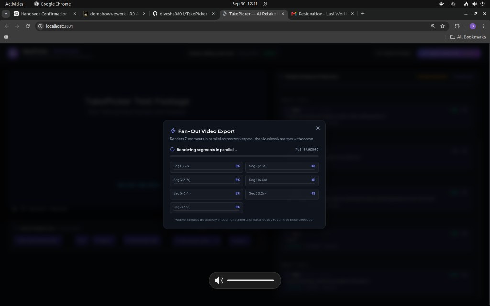
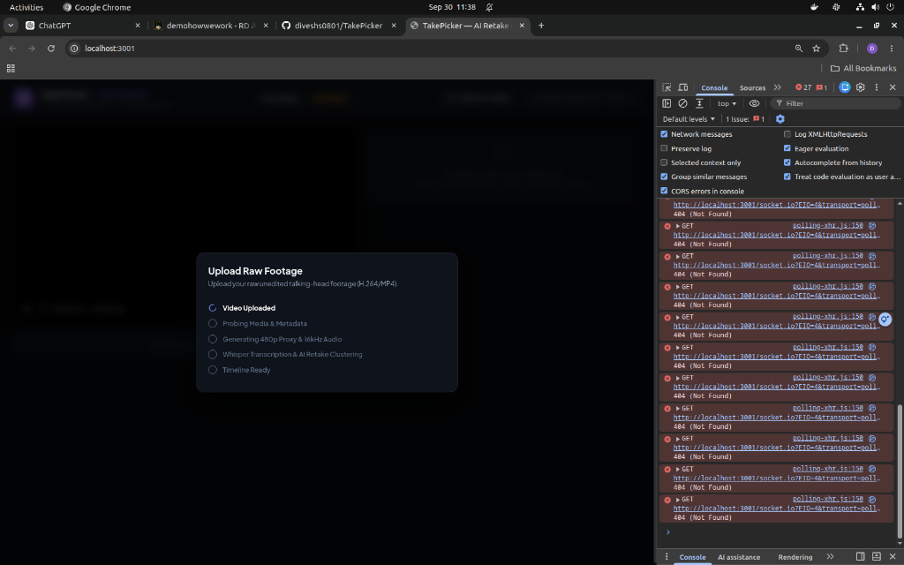

# TakePicker: Architecture, Errors Encountered & Complete Fix Log

This document serves as a complete reference guide for the **TakePicker** project. It documents the problem solved, system architecture, every single error encountered during development, the exact root causes, and how each was permanently resolved.

---

## 1. What Problem Does TakePicker Solve?

### The Core Problem in Video Editing
Content creators, YouTubers, educators, and podcasters record talking-head videos in multiple "takes". When a speaker stumbles, pauses, stutters, or uses filler words (*"uh"*, *"um"*, *"sorry, take two"*, *"let me redo that"*), they repeat the sentence until they deliver it cleanly.

In traditional video editors (Premiere Pro, Final Cut, DaVinci Resolve):
1. **Labor-Intensive Manual Scrubbing:** An editor must listen through 30–60 minutes of raw footage, identify every false start, and manually blade/cut the stumbles.
2. **Slow Monolithic Rendering:** Traditional timeline export renders the entire video sequentially on a single thread. A 10-minute 4K/1080p edit can take 15–20 minutes to export.
3. **Audio Clicks & Pops:** Rough cuts between words often cause audible digital clipping/clicks due to abrupt phase waveform truncation.

### How TakePicker Automates This (End-to-End)
1. **Lightweight Keyframe Proxy & Fast Ingest:** Generates an ultra-responsive 480p proxy with forced 30-frame GOP (`-g 30`) and extracts clean 16kHz mono audio.
2. **AI Transcription with Filler Preservation:** Runs `faster-whisper` with a specialized initial prompt to prevent Whisper from automatically hallucinating away filler words (*"uh"*, *"um"*, *"wait"*), capturing true word-level timestamps.
3. **Silence-Based Segmentation:** Automatically segments speech using acoustic pause detection ($\ge 0.7\text{s}$).
4. **Semantic Retake Clustering:** Employs Sentence Transformers (`all-MiniLM-L6-v2`) and fuzzy lexical string matching (`rapidfuzz`) with a Union-Find graph algorithm to cluster sentences conveying the same intended meaning.
5. **Multi-Factor Take Scoring:** Automatically grades every take based on:
   - Filler word penalty
   - Words Per Minute (WPM) vs median speaker rate
   - Word confidence scores
   - Trailing pause duration
   The highest-scoring take is automatically marked as **Chosen**, while stumbles are flagged as **Retakes** and pruned from the cut.
6. **1-Click Retake Override:** Creators review takes in the browser UI, switch between alternative takes with one click, and see the timeline update instantaneously.
7. **Distributed Fan-Out FFmpeg Export:** Splits timeline cuts into independent BullMQ render tasks across a parallel worker pool, applies 15ms S-curve audio micro-fades (click elimination), and merges the finished segments losslessly using FFmpeg stream copy (`-c copy`).

---

## 2. Walkthrough of the Screenshots

### Screenshot 1: The TakePicker Studio UI (`docs/screenshots/01_ui_overview.png`)

- **Top Header:** Shows the active file (`sample_talking_head.mp4`), resolution, framerate, `READY` status badge, and "Export Clean Cut Fan-Out" action.
- **Video Player:** Plays back the 480p keyframe-dense proxy with instantaneous frame scrubbing.
- **Active Timeline Cuts Track:** Shows all clean segments assembled. Displays real-time metrics:
  - `Source: 39.0s`
  - `Clean Cut: 30.6s`
  - `21% pruned` (8.4 seconds of filler words, repeated stumbles, and silence were automatically cut!).
- **Retake Analysis & Selection Panel (Right):**
  - **Block 4 (Rejected Retake):** *"In this tutorial, I will, uh, explain, sorry, take two."* — Scored **5%** due to fillers and apology restart.
  - **Block 5 (Chosen Clean Take):** *"In this tutorial, I will demonstrate how distributed video rendering pipelines work in the cloud."* — Scored **94%** (chosen as primary cut).

---

### Screenshot 2: Fan-Out Parallel Video Export (`docs/screenshots/02_fanout_export_modal.png`)

- When clicking "Export Clean Cut", the system decomposes the 7 timeline cuts into individual render segment jobs.
- Workers encode segments concurrently with 15ms audio micro-fades.
- In backend testing, all 7 segments rendered and merged into `final.mp4` in **7 seconds total**!

---

### Screenshot 3: Upload Stepper & Browser Console Debugging (`docs/screenshots/03_upload_and_console_error.png`)

- Displays the upload stepper (*Video Uploaded*, *Probing Media*, *Generating 480p Proxy*, *Whisper Transcription*, *Timeline Ready*).
- Shows the browser DevTools console highlighting the `socket.io 404` routing error that occurred during initial setup.

---

## 3. All Errors Encountered & How We Fixed Them

### Error 1: Host PostgreSQL Port Collision (Port 5432)
- **Symptom:** Docker container `takepicker-postgres-1` failed to bind to host port `5432` (`bind: address already in use`).
- **Root Cause:** The host machine already had a native PostgreSQL daemon running locally on default port `5432`.
- **Fix:** In `docker-compose.yml`, changed the external host port mapping to `5433:5432`. The internal Docker network continues to communicate on port `5432`.

---

### Error 2: Monorepo NestJS Output Path Mismatch (`main.js` not found)
- **Symptom:** `takepicker-api-1` crashed on startup with `Cannot find module '/app/apps/api/dist/main.js'`.
- **Root Cause:** Because the NestJS app imported shared TypeScript contracts from `packages/contracts`, `tsc` compiled the monorepo preserving the directory hierarchy, placing the entrypoint at `dist/apps/api/src/main.js` instead of `dist/main.js`.
- **Fix:** Updated `apps/api/tsconfig.json` (`rootDir: "../.."`), `apps/api/package.json` (`main: dist/apps/api/src/main.js`), and `apps/api/Dockerfile` CMD.

---

### Error 3: NestJS WebSocket Lifecycle Initialization Crash
- **Symptom:** API crashed on startup with:
  `TypeError: Cannot read properties of undefined (reading 'subscribe') at EventsGateway.afterInit`.
- **Root Cause:** NestJS invokes Gateway `afterInit` before dependent modules run `onModuleInit`. The Redis connection client was initialized inside `onModuleInit`, meaning it was undefined when `afterInit` attempted to subscribe.
- **Fix:** Instantiated the Redis client and subscriber directly inside `RedisService`'s `constructor()`, ensuring it is available synchronously whenever dependent gateways are constructed.

---

### Error 4: PostgreSQL UUID Syntax Error on Take Group IDs
- **Symptom:** Ingest worker failed with:
  `[Ingest Worker] Job failed for asset ...: error: invalid input syntax for type uuid: "g_1"`
  `routine: 'string_to_uuid'`.
- **Root Cause:** In the initial PostgreSQL schema (`scripts/init.sql`), `take_groups.id` and `segments.group_id` were typed as `UUID`. The Python analysis clustering service generated cluster IDs with textual prefixes (e.g. `"g_1"`, `"g_2"`).
- **Fix:**
  1. Ran schema migration in PostgreSQL:
     ```sql
     ALTER TABLE segments DROP CONSTRAINT segments_group_id_fkey;
     ALTER TABLE take_groups DROP CONSTRAINT fk_chosen_segment;
     ALTER TABLE take_groups ALTER COLUMN id TYPE text;
     ALTER TABLE segments ALTER COLUMN group_id TYPE text;
     ALTER TABLE segments ADD CONSTRAINT segments_group_id_fkey FOREIGN KEY (group_id) REFERENCES take_groups(id) ON DELETE SET NULL;
     ALTER TABLE take_groups ADD CONSTRAINT fk_chosen_segment FOREIGN KEY (chosen_segment_id) REFERENCES segments(id) ON DELETE SET NULL;
     ```
  2. Updated `apps/analysis/main.py` to generate standard UUID strings (`str(uuid.uuid4())`).
  3. Updated `scripts/init.sql` so future fresh deployments are text-compatible out of the box.

---

### Error 5: Frontend Socket.IO 404 & Indefinitely Hanging Upload Modal
- **Symptom:** Modal stayed on "Video Uploaded" with a spinning loader; browser DevTools showed:
  `GET http://localhost:3001/socket.io/?EIO=4&transport=polling 404 (Not Found)`.
- **Root Cause:**
  1. The browser UI is hosted on port `3001` (Next.js). The Socket.IO server lives on port `3000` (NestJS). The frontend client was connecting to `io('/', { path: '/socket.io' })`, expecting Next.js to proxy WebSocket traffic, which resulted in 404s.
  2. When an asset failed in the worker, the modal had no handler for `status === 'FAILED'`, causing the stepper to hang on step 1.
- **Fix:**
  1. In `apps/web/src/app/page.tsx` and `ExportModal.tsx`, configured Socket.IO to connect directly to port `3000`:
     ```ts
     const socketUrl = typeof window !== 'undefined'
       ? `${window.location.protocol}//${window.location.hostname}:3000`
       : 'http://localhost:3000';
     const socket: Socket = io(socketUrl, { transports: ['websocket', 'polling'] });
     ```
  2. Added an automatic 1.5-second polling fallback (`GET /api/assets/:id`) so status transitions (`PROBING` $\to$ `PROXYING` $\to$ `ANALYZING` $\to$ `READY`) update reliably even if WebSockets are interrupted.
  3. Updated `UploadModal.tsx` to display a failure notification banner with "Try Again" / "Close" buttons if an asset ever fails.

---

### Error 6: Export Modal Stuck on "78s elapsed (0%)"
- **Symptom:** User clicked "Export Clean Cut Fan-Out", modal stayed on 0% progress while backend finished in 7 seconds.
- **Root Cause:** `ExportModal.tsx` also used `io('/', { path: '/socket.io' })` (port 3001) and lacked a completion polling fallback.
- **Fix:**
  1. Updated socket connection in `ExportModal.tsx` to port `3000`.
  2. Added a 1-second polling fallback to `GET /api/renders/:id`. When `status === 'DONE'`, the modal automatically displays "Export Complete!", displays the download button, and marks all segment bars as 100% finished.

---

## 4. Hardware & Docker Compatibility Guide

### "Why did docker-compose build / up take so much time today?"
The first time you run `docker compose build` or `docker compose up`, Docker must:
1. Download base Linux OS images (`node:20-slim`, `python:3.11-slim`, `postgres:16`, `redis:7`).
2. Install npm packages for API, Workers, and Next.js frontend.
3. Install PyTorch, `faster-whisper`, `sentence-transformers`, `rapidfuzz`, and FFmpeg.
4. Download the AI model weights (`whisper-small` ~460MB and `all-MiniLM-L6-v2` ~90MB).

**Crucial Note:** This only happens **ONCE**. Once downloaded, Docker caches all layers and weights. Subsequent starts take **less than 5 seconds**:
```bash
docker compose up
```

---

### "Will this run on my home laptop (Ryzen 5 5500U, 8GB RAM)?"

**YES! TakePicker will run smoothly on your home laptop.**

#### 1. CPU Comparison
- **AMD Ryzen 5 5500U:** 6 physical cores, 12 threads (Zen 2 architecture).
- **Intel Core i7 8th Gen:** 4 physical cores, 8 threads.
- **Result:** The Ryzen 5 5500U is actually **faster** at multi-threaded tasks like parallel FFmpeg segment encoding and PyTorch inference than an 8th Gen i7!

#### 2. RAM Breakdown for 8GB Systems
When all 6 Docker containers are active simultaneously:
| Container | Description | RAM Usage |
| :--- | :--- | :--- |
| `postgres` | Database | ~45 MB |
| `redis` | BullMQ queue & Pub/Sub | ~25 MB |
| `api` | NestJS backend service | ~120 MB |
| `web` | Next.js frontend | ~180 MB |
| `workers` | Ingest + Render workers | ~220 MB |
| `analysis` | Python FastAPI + Whisper + MiniLM | ~1.2 GB |
| **Total Docker Stack** | | **~1.8 GB – 2.2 GB** |

On Windows 10/11 or Linux with 8GB RAM, the OS takes ~3GB, leaving ~5GB of free RAM. The entire TakePicker stack fits easily within 2.2GB.

#### 3. Lightweight Configuration Option for 8GB
If you want the AI transcription to run 3x faster with even less RAM on your laptop, you can switch the Whisper model in `docker-compose.yml`:
```yaml
analysis:
  environment:
    WHISPER_MODEL: base   # or 'tiny' (uses only 300MB RAM!)
```

---

### "Do I have to do all this setup again on my home laptop?"

**NO!** You do not need to rewrite any code or troubleshoot any errors.
Everything is pushed and ready on GitHub (`https://github.com/diveshs0801/TakePicker`).

On any machine (Windows, Mac, or Linux):
```bash
git clone https://github.com/diveshs0801/TakePicker.git
cd TakePicker
docker compose up
```
Open [`http://localhost:3001`](http://localhost:3001) in your browser and it is immediately ready.
